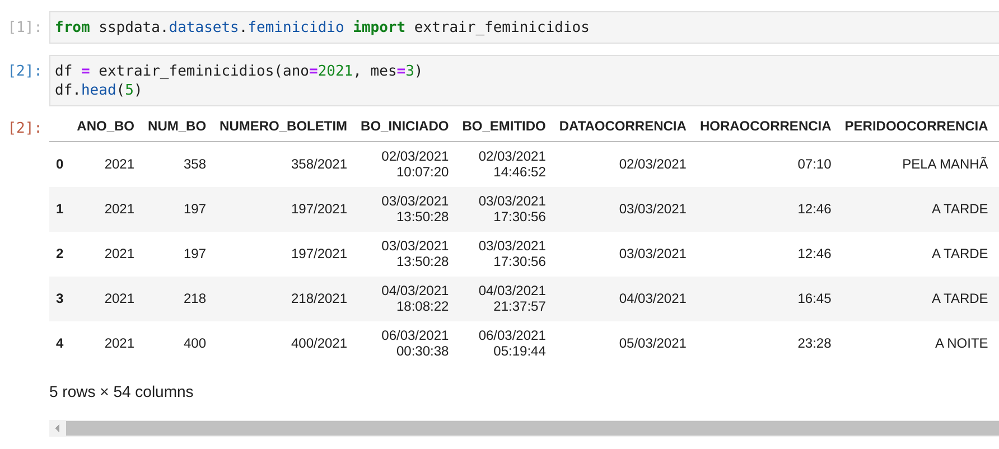

# sspdata

## Como instalar
```
pip install sspdata
```


## Como usar
```python
from sspdata.datasets.feminicidio import extrair_feminicidios

df = extrair_feminicidios(2021, 6)
```


## Como contrubuir?

Instale as dependências do projeto (prod e dev)
```
$ poetry install
```
Code...
Code...
Code...

Para checar se o código está dentro dos padrões:
```
$ poetry run fmt
$ poetry run isort-fmt
$ poetry run linter
$ poetry run tests
```
Agora é só abrir o PR e aproveitar a review :)